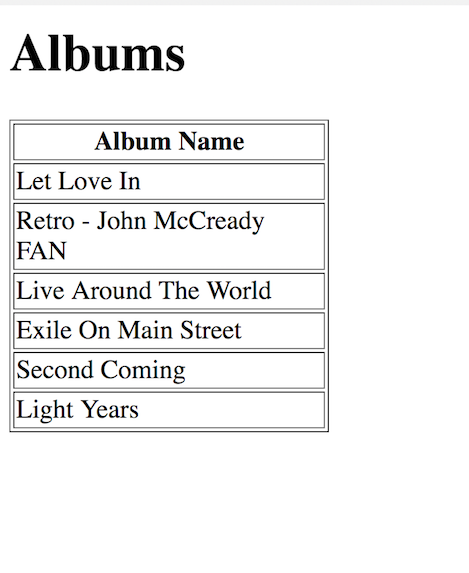

# SSAD 2018 - Ajax Exercise 1

## Git Bash Setup

```
$ cd /xampp/htdocs
$ mkdir ajax-ex1
$ cd ajax-ex1
$ git init

...

$ git remote add origin <GitHubRepository_URL>

...

$ git pull origin master
$ git status

```

## Git Bash Update

```
$ git status
$ git commit -a -m "YOUR UPDATE MESSAGE"
$ git push origin master

```

## Part 1

1.	Open the HTML file [artists.html](http://localhost/ajax-ex1/artists.html)

1.	Thoroughly examine the code in the HTML, JavaScript and PHP files.  Make sure you understand the code.

1.	Update the code so the artist_id of each artist is shown as the first column in the HTML table shown.

1.	Commit these changes to your repository by using the following git bash commands:

	```
	$ git status
	$ git add .
	$ git commit -m "added artist_id to table"
	$ git push origin master

	```


## Part 2

1.	Run the PHP program [albums.php](http://localhost/ajax-ex1/albums.php?artist_id=1).  Notice how it is passed an argument called ``artist_id`` and a value - this returns the album names for artist id 1.  In the address bar of your browser change the value of ``artist_id`` to 2 or 3 or 4 to see albums for other artists.

1.	Provide the missing code in ``albums.js`` to display the output shown below:

	


